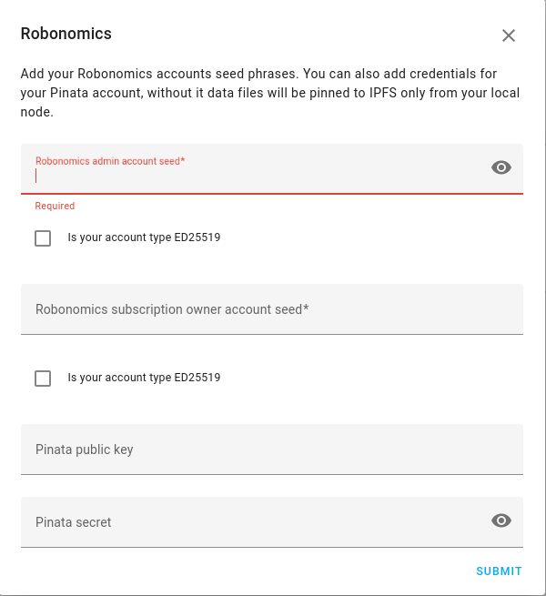

# Control Home Assistant with Robonomics

Integration track subscription devices and manage Home Assistant users.

## Installation

In your computer with Home Assistant clone the repository to `custom_componets`:

```bash
sudo -u homeassistant -H -s
cd ~/.homeassistant/
mkdir custom_components
cd custom_components
git clone https://github.com/LoSk-p/robonomics_smart_home.git robonomics_smart_home
```
> The folder must have name `robonomics_smart_home`

Install python dependency:
```bash
source /srv/homeassistant/bin/activate
pip install http3
```

Install ipfs local node:

```bash
su ubuntu
wget https://raw.githubusercontent.com/LoSk-p/robonomics_smart_home/main/install_ipfs.sh
sudo chmod +x install_ipfs.sh
./install_ipfs.sh
```

Then restart Home Assistant:
```bash
sudo systemctl restart home-assistant@homeassistant.service
```

## Configure

For the Robonomics integration you need an [account](https://wiki.robonomics.network/docs/en/create-account-in-dapp/) with [subscription](https://wiki.robonomics.network/docs/en/get-subscription/). Also you need an admin account added to subscription as a device (all accounts should be ed25519 type). Admin account will send telemetry from Home Assistant and will be able to send commands to smart devices.  

In the web interface go to `Settings/Devices & Services/Integrations` and press `Add Integration`. Find `Robonomics`:



Then write mnemonic seeds from Robonomics accounts. Integration use IPFS to save encrypted data, by defaul it uses local node and infura IPFS API, but you can use your Pinata account in addition.
