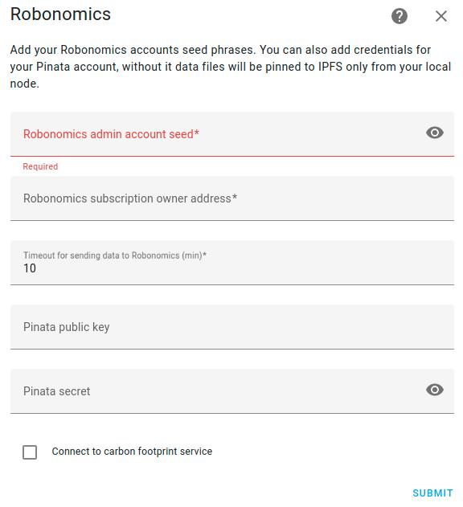

# Control Home Assistant with Robonomics

Integration allows to watch telemetry from Home Assistant in blockchain and control smart devices. More information you can find on [Robonomics Wiki](https://wiki.robonomics.network/docs/en/home-assistant-begin/).

## Installation

1. Install files:
* Using HACS:
In the HACS panel, go to integrations and click the big orange '+' button. Search for 'Robonomics' and click 'Install this repository in HACS'.
* Manually:
Clone the [repository]() and copy `custop_components` folder to your Home Assistant config
2. Restart HA to load the integration into HA.
2. Go to Settings -> Devices & Services -> Integrations and click the 'Add Integration' button. Look for Robonomics and click to add it.

## Configure

For the Robonomics integration you need an [account](https://wiki.robonomics.network/docs/en/create-account-in-dapp/) with [subscription](https://wiki.robonomics.network/docs/en/get-subscription/). Also you need an admin account added to subscription as a device (it must be ed25519 type). Admin account will send telemetry from Home Assistant and will be able to send commands to smart devices.  

Write mnemonic seed of your Robonomics admin account and the address of subscription owner account. Integration use IPFS to save encrypted data, by defaul it uses local node and infura IPFS API, but you can use your Pinata account in addition.

